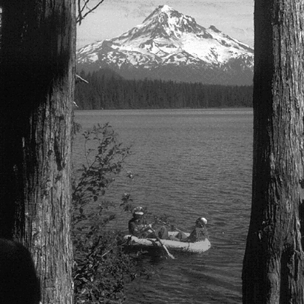

# Validation Tests
## Case 1
|Property|Value|
|--|--|
|Signed Image||
|Hash|0641887a4cbb2e10d0891db075cac8bdcb91856d93b6310544403d35cf766864|
|Sign|9891b74755e1cba7e2b0062be79cc62b702d9609712bc7e6d1122096d72c074e|
|PSNR|81.27816561863614|
|Verify|True|
  
## Case 2
|Property|Value|
|--|--|
|Signed Image||
|Hash|818c848b63bd12282cbc245892d8bfb7fdc8c36544fda9f42bd20d45730469dc|
|Sign|dc003f24f8b5e67d9cb960fa893c64626d9635c5e44ad6897308abb0dd1dae6b|
|PSNR|81.04515484454764|
|Verify|True|
  
## Case 3
|Property|Value|
|--|--|
|Signed Image||
|Hash|674328f31f9872872762e01fba671b9701ae1aa782ef7a587902052b3b186aa0|
|Sign|7ca63350b62482cb983abfb64b8d3dad232f509a1453ef6a25645f2158d2ff9f|
|PSNR|81.59738275513446|
|Verify|True|
  
## Case 4
|Property|Value|
|--|--|
|Signed Image||
|Hash|f8e35ae272a822e4d2edde72e795d17940b9304772917a95398e2c3e20f3a3e5|
|Sign|c38989e8bb2747953b90ee0de35458ce2daffa9844e308f9e7b49be957e05b4d|
|PSNR|81.7092244246596|
|Verify|True|
  
## Case 5
|Property|Value|
|--|--|
|Signed Image||
|Hash|00841ec1d819fbfe5e707ceb1771abff09bc33cbebc6ad1978aa28300cbfbed0|
|Sign|72275b7adaf1433ab30201b03043203673d24f6b860d9a3c42178496c1e0c515|
|PSNR|81.56073321427041|
|Verify|True|
  
## Case 6
|Property|Value|
|--|--|
|Signed Image||
|Hash|2d14db3390ac7df80a0d935f6ca12d0f280904533578e92b5b515390cb2b0f44|
|Sign|f945fece7e0cbdd8ed35d99c5f45841f6c2ec23e9943081d430ffd4635eb9326|
|PSNR|82.06314417554802|
|Verify|True|
  
## Case 7
|Property|Value|
|--|--|
|Signed Image||
|Hash|36ec46329a91bee12098f690726fa255befe67dd7165a30edf34ef38d2a48c19|
|Sign|dacb820868b76cbe47d4ade381cfe094aa11172b407b5d57d102fd593d39e709|
|PSNR|91.90227597661347|
|Verify|True|
  
## Case 8
|Property|Value|
|--|--|
|Signed Image||
|Hash|bb473a5e7504bf760074d7d204fbc0e4936c522c8d190a83db5c64f7bf3be2ff|
|Sign|c143cc20bef4adeb9a715ed3b5a20d473d18ead92e06962a26e88ba7af81ba49|
|PSNR|84.53469032435927|
|Verify|True|
  
## Case 9
|Property|Value|
|--|--|
|Signed Image||
|Hash|0bfb5cb4e05ec36929417b973d06fa79cbc03b76ea3b9c08df7738fa848f48f9|
|Sign|d0941d45e4cc3dbbb9d3474e68f2123c6144e5c69f0dea719c3a7fdd1ab96e79|
|PSNR|80.497766948748|
|Verify|True|
  
## Case 10
|Property|Value|
|--|--|
|Signed Image||
|Hash|489efea9f80fdb30b7730fef4f55154ccff8583134c8b5e05cf7104f96109fb2|
|Sign|ae3d3333a836a374410fa665bddc1fa06ea3864176c188f13a2681833df12c60|
|PSNR|81.7092244246596|
|Verify|True|
  
## Case 11
|Property|Value|
|--|--|
|Signed Image||
|Hash|991f5edf102434ccb935e238415d8669498d60cc3d6fb0d770f1f41fb3ccbd8a|
|Sign|2c47ebf86cf45b17200a8c6c4d81fdef4cf8f3747e5633c897887eaea10354f6|
|PSNR|96.29560291491609|
|Verify|True|
  
## Case 12
|Property|Value|
|--|--|
|Signed Image||
|Hash|6d6a3d9276ee2e1b3b0ec55bd5f8adf0dd56a1ba0e23c684698324e1a464ac26|
|Sign|c332097edf0d0b12f1583518dbe97b8f704566729b64a56894eb1c74cf033e51|
|PSNR|81.04515484454764|
|Verify|True|
  
## Case 13
|Property|Value|
|--|--|
|Signed Image||
|Hash|e92a2cf03ff1ce228f6a6116ccbb87e2fdd247b52fa9630b7a57b272648b8169|
|Sign|ecd72c4e8e2f93c4494554aeab3ce8eb9e23df076a1f44bc01beb110fa6fd678|
|PSNR|81.94193784878948|
|Verify|True|
  
## Case 14
|Property|Value|
|--|--|
|Signed Image||
|Hash|20545907bf7453e1c16e0a755c716b73e8ea2398eb790b42c8e99a7a66fa6624|
|Sign|a88cab452438d45ee60ba86d3e68a905ffc3810b9a355b3e58c73a095f235406|
|PSNR|81.04515484454764|
|Verify|True|
  
## Case 15
|Property|Value|
|--|--|
|Signed Image||
|Hash|5f8c7ad27d96fbed213081e2103d2bfd68bd1c1f04240fc32a6d73bc3b000ef7|
|Sign|cb20c5efc465f5bb31ebfd0f8b668b04c45e91dff4b910914690ab1914b1e9bc|
|PSNR|84.91257593325328|
|Verify|True|
  
## Case 16
|Property|Value|
|--|--|
|Signed Image||
|Hash|727b1e9e91f23082989a1d29c7075540282eb5e354063066e0d0d885d83a2311|
|Sign|dad898195260599bc1e49daae5b0773656577d0802bb30175b6daebe14502951|
|PSNR|80.85492247141333|
|Verify|True|
  
## Case 17
|Property|Value|
|--|--|
|Signed Image||
|Hash|d0353c8d9bb4ad90b573f5aa7e62ac29e794e113d5494c571be0f47905a58a9c|
|Sign|29aaf849c9c2f6ddb31bb20280cd2ce5122a18189607a6975e99674bba82c059|
|PSNR|82.40394207127076|
|Verify|True|
  
## Case 18
|Property|Value|
|--|--|
|Signed Image||
|Hash|6865b9590b71f1adf9606cc74b0b41468970cfd8c497887c4acb872450a79c4c|
|Sign|ccd3c39bbd8aa50ef9470285b4f2c0ac3468a0972c80e08f1e7b3d35d166fff5|
|PSNR|81.7092244246596|
|Verify|True|
  
## Case 19
|Property|Value|
|--|--|
|Signed Image||
|Hash|c09c185c610a40d36e204b1f72a35d216419f068643333db5059770ba44d88e4|
|Sign|e703378ddaab92b41393a2f29ea7a347a8af9cb2bf4f5c76a983cfabb4344565|
|PSNR|81.94193784878948|
|Verify|True|
  
## Case 20
|Property|Value|
|--|--|
|Signed Image||
|Hash|405a13ba310dda71b69f45d34d0751f44a7165b2e763e8bbcd53022542c0ff5c|
|Sign|90d665919010eb0e4355f212e9f6f40ba4bb5813301dfec7e81b1bf36696e959|
|PSNR|81.31249737702008|
|Verify|True|
  
## Case 21
|Property|Value|
|--|--|
|Signed Image||
|Hash|63e26d39dc27cb32e15cd9fc728de0faed97c2d3e81d8ca9093bcaed270e2b6f|
|Sign|642436412d9ef273f5ab41b22a16ec0cb2bee7832b1cff1caee2e5ccd7b79b28|
|PSNR|80.35720630410339|
|Verify|True|
  
## Case 22
|Property|Value|
|--|--|
|Signed Image||
|Hash|cbdf41e96fca109bead1a41b8d6b03dcc8af4392187dddd716d84eddf8ef7222|
|Sign|707410c7284c4411a01a13728b13840af4bc50025834d23fdeab8c0f696ec609|
|PSNR|81.67162293592654|
|Verify|True|
  
## Case 23
|Property|Value|
|--|--|
|Signed Image||
|Hash|49685f4282a01d926447f0d4d662e8ec3080c4491af6407ba6b9a8792c642b28|
|Sign|605568bf522095ebbbe99476c81443f974f8b9057ead96e6e6a06be52f3e5685|
|PSNR|80.91741196418334|
|Verify|True|
  
## Case 24
|Property|Value|
|--|--|
|Signed Image||
|Hash|af2ef20aa403dbb4ccb5099a2db0259c08f5c45347f1a32d5f5ff95ecce8f76d|
|Sign|1ff3f7ddfad677ff2404f29559aa41ff13503f7d849ba172898d74f7a46e21b5|
|PSNR|80.5552902376389|
|Verify|True|
  
## Case 25
|Property|Value|
|--|--|
|Signed Image||
|Hash|c1f414827adc8af1a23f69450c2def5ac2bc8b0914974354f92b083bc8d8764e|
|Sign|4e21a15f8ef7c74c9ed80bb06ac1e1de0961f5600ee11600cef61aab704f989c|
|PSNR|81.14348987163808|
|Verify|True|
  
## Case 26
|Property|Value|
|--|--|
|Signed Image||
|Hash|6541ae61f6386122eaf9467e2eb02be7d9225c61d4fb67b87a3f77dbe3d69f68|
|Sign|2049ad1980f351cacd9ebab90f6dadde9eaf9ac814d61fafeb7c1b16ce1745e5|
|PSNR|80.16776434771873|
|Verify|True|
  
## Case 27
|Property|Value|
|--|--|
|Signed Image||
|Hash|980a4f221eef332915aa5643017f03ddaa4f7792f752680153e85e487e367463|
|Sign|b119912f10642e40e90840e1225471e2edea3f840c8ee98582e4975d48e5e319|
|PSNR|82.87137610669403|
|Verify|True|
  
## Case 28
|Property|Value|
|--|--|
|Signed Image||
|Hash|9b77e1bd4215ad673a3e538c1aec10fbc4db213fc08e96f632c2848f65ce8f4b|
|Sign|c971c43281560f82add5ba5f00d33617d96f9b98fabb9b3381b8bcca9237c0ea|
|PSNR|82.31620282819571|
|Verify|True|
  
## Case 29
|Property|Value|
|--|--|
|Signed Image||
|Hash|f5e010b96b1337be248228a30efd315a63110e38b31f49a34b6c4f5457969f17|
|Sign|4245b492ac4c34245daa7259884b93709c3fa1a414d4e6efed3b8a25b553e529|
|PSNR|82.35985088222021|
|Verify|True|
  
## Case 30
|Property|Value|
|--|--|
|Signed Image||
|Hash|e0007fd9f3f6999fd5e7df9848d3e579c84910fa06b3bc4aa92355198746e06c|
|Sign|916cb49feb5910cc9e912c094890ee0dfa6955d04ea0fbea816a90967cab3ca4|
|PSNR|85.07344413218783|
|Verify|True|
  
## Case 31
|Property|Value|
|--|--|
|Signed Image||
|Hash|fb4c4b4a55fe7313e61b4e6861de69c9323e64281160271b7e455f31740a4c9f|
|Sign|88804168c3fe2fc773a8a692591d6de3dd6451855e9310d0daac0d8fe8e33ec1|
|PSNR|80.5552902376389|
|Verify|True|
  
## Case 32
|Property|Value|
|--|--|
|Signed Image||
|Hash|a5a409457613e5d160a3f3f9fa2755b76e86704f8694791b6c5357ef2e32823a|
|Sign|34b482e557f7df287b3e1cdc9154f6b3cbf03bd9a1744a71dacc57e482f5843f|
|PSNR|99.3059028715559|
|Verify|True|
  
## Case 33
|Property|Value|
|--|--|
|Signed Image||
|Hash|e2f489cf5cbc0bb03be19e542655f90b63f83eb6c5ae09f9441d0e7368c3b43f|
|Sign|e57a667d5b308d73eecfa78409b128d8954a822758b72013a779f6f2f8b593a4|
|PSNR|80.24794406787721|
|Verify|True|
  
## Case 34
|Property|Value|
|--|--|
|Signed Image||
|Hash|16b87ad4b75c91a2cb989d4f98db058d11a4c6c5cb3eb21c81fe8789a56eca93|
|Sign|9ddc759473781d716ab947f90aa56c4c3edab3233d3dc00e050fddee81a4ac3e|
|PSNR|80.64302948071395|
|Verify|True|
  
## Case 35
|Property|Value|
|--|--|
|Signed Image||
|Hash|b9621245ad166d78ad5241fc18ec4cb2393657a32a586d2b5b48b1b2fc1f94f3|
|Sign|a6b08cfd4df75c466d7b6b28c4f642a38e9026d51624f19de825ed4f85d89b99|
|PSNR|81.27816561863614|
|Verify|True|
  
## Case 36
|Property|Value|
|--|--|
|Signed Image||
|Hash|2ad335fdd35ca7098be16ce4406a26c541da119e4718d1213a466ba084628709|
|Sign|c20f4c4dfe6bdb2505ee58ff2106ba09f565f33956daafae9f11224408e69f52|
|PSNR|81.27816561863614|
|Verify|True|
  
## Case 37
|Property|Value|
|--|--|
|Signed Image||
|Hash|2dce19d6115eddce4140502e4a8d551c2e079ae1e4f4cabb904b00cd5cd1ffb7|
|Sign|ebc63d20534606772750f75cb336b77a439691ac273be0b06bc0c2c618c7340e|
|PSNR|81.45260452144824|
|Verify|True|
  
## Case 38
|Property|Value|
|--|--|
|Signed Image||
|Hash|3a2ec1c8bbfc82913cc485908568f84ecacfa557d2e3cb8caa3ee1f88e84a56f|
|Sign|7671033e533efbffadc76e41d0070f3e23443af3502f954ca743ebb724117e72|
|PSNR|80.11512194779516|
|Verify|True|
  
## Case 39
|Property|Value|
|--|--|
|Signed Image||
|Hash|663c54d4f8199870e688f804bcc7e82411d72d9c238ba919b9f623340ba3a5e4|
|Sign|ccb199080fe2134089559bc1ac1afd52fec6b079b1ec9b28538f8fb4660db612|
|PSNR|79.3715405665798|
|Verify|True|
  
## Case 40
|Property|Value|
|--|--|
|Signed Image||
|Hash|e8707cf57d0310fb12eebbfa4440fae590e975cd1db4423f5a7f4c3cff68c611|
|Sign|98ea782ca42c986057be34b754c2b6f147c2a5070fcdb276b214ec0b05a36748|
|PSNR|81.6343442107341|
|Verify|True|
  
## Case 41
|Property|Value|
|--|--|
|Signed Image||
|Hash|26fc375c555b246d94a82fc0a200e392488b02a17d449d0713eed45cb5dadf2d|
|Sign|cd9ee0b42244a4b8c525288e038192540c7a03b0106eaba7121eec2a039c7fb0|
|PSNR|81.90227597661347|
|Verify|True|
  
## Case 42
|Property|Value|
|--|--|
|Signed Image||
|Hash|157dbb6ce22a0b37244ffc43b225e03a37de8358900023335875de328b90b04e|
|Sign|cb7417caf6fab2300b0731370b84fd1a37fd2a1165331a92c1ccb35481813ca0|
|PSNR|80.98081374449353|
|Verify|True|
  
## Case 43
|Property|Value|
|--|--|
|Signed Image||
|Hash|25dacc891dc823d1c0ad687a55dca4cbae4436543a3e4b3b09ffa239e79100fd|
|Sign|d59508af8d210bb46f17e4d36440f58bd41411363aa70af4ba66e895e47d308d|
|PSNR|80.98081374449353|
|Verify|True|
  
## Case 44
|Property|Value|
|--|--|
|Signed Image||
|Hash|3d2f93ca97376ef86624d28f183f0b6ca77923d11d5d433c02a6f7e84488a642|
|Sign|ac1d138d0160b7d0bc4bd48e5bbb5245fe7b33a2e9b6e35a320c8ba7f1b78470|
|PSNR|80.98081374449353|
|Verify|True|
  
## Case 45
|Property|Value|
|--|--|
|Signed Image||
|Hash|a1b8d1f726879f2221569366b21e76b1cb6f115a6ebe2e3d5b45affbee31d5ba|
|Sign|e57efdfe594311160eac5dab156eb54146be0c3672800283ff214464fb170d34|
|PSNR|81.11046351613722|
|Verify|True|
  
## Case 46
|Property|Value|
|--|--|
|Signed Image||
|Hash|5eaab0411cdf213974d6eda01c9166f76f3960fd9b40075f079771fc27223c66|
|Sign|1c867fe8f847c50b9afc60666f35bbdf011234b38f8d0644f8e71691fa1b0c97|
|PSNR|80.52643335526403|
|Verify|True|
  
## Case 47
|Property|Value|
|--|--|
|Signed Image||
|Hash|b7765049ed6b7bd3feb6132a815bd2f3a0507ee31aaa091b33fde71cc8bf0092|
|Sign|12e35695ef00a37240a06d91470bb5d55894bd03629763593b7eaf4879e6952f|
|PSNR|81.07768641852486|
|Verify|True|
  
## Case 48
|Property|Value|
|--|--|
|Signed Image||
|Hash|18b24449b481c8b8cac1174df256f239b08abc76e7477f9dbda88b82b909f37f|
|Sign|4e5b9eacba7cc0ae528370239f0564957cca3a5b601c2e029a8b2a3b8363553f|
|PSNR|81.52439036771946|
|Verify|True|
  
## Case 49
|Property|Value|
|--|--|
|Signed Image||
|Hash|fbe8a549997a4d990f4e605b41278adb880b02788ca9c3f1b2771c6ef7051cfe|
|Sign|d049150a85fdfb449f3da3eaa41c1f84020e40cfa269730f4ec6d31c91b09297|
|PSNR|82.58492429219872|
|Verify|True|
  
All validation test cases passed
  
